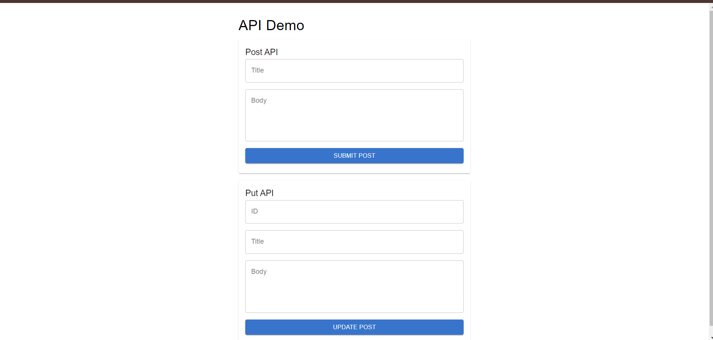
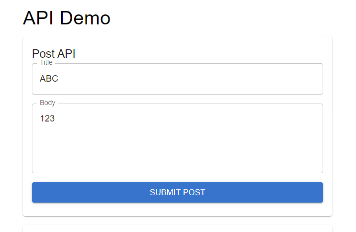
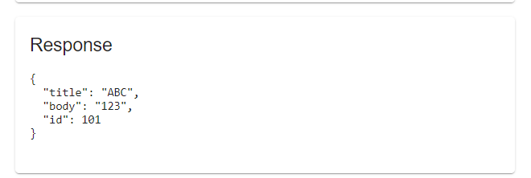
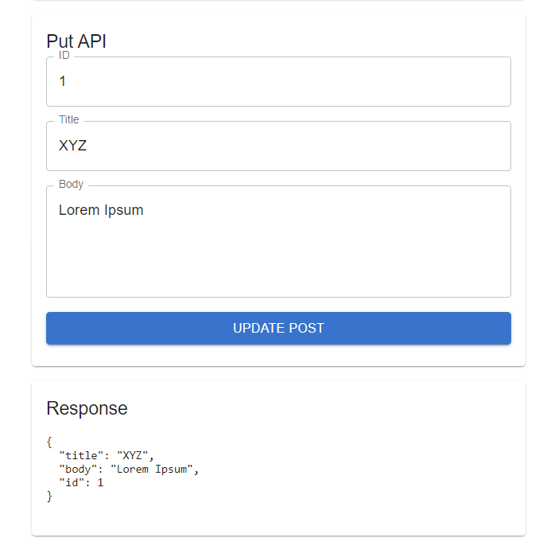

# React API Demo 

This project demonstrates how to create a simple React application that interacts with a API using Axios and uses MUI for styling.

## Features

- **POST and PUT API Requests**: Allows users to send POST and PUT requests to a mock API.
- **Error Handling**: Provides detailed error messages based on the type of error.
- **State Management**: Manages form state and API responses using React's `useState`.
- **Styling**: Uses MUI for styling the application components.

## Image

## Usage

### POST API Request

1. **Navigate to the application in your browser.**
2. **Enter data in the "Post API" form:**
   - **Title:** Enter a title for the post.
   - **Body:** Enter the body content for the post.
3. **Click the "Submit Post" button.**

4. **Observe the response below the form.**

### PUT API Request

1. **Navigate to the application in your browser.**
2. **Enter data in the "Put API" form:**
   - **ID:** Enter a valid ID (e.g., 1).
   - **Title:** Enter a new title to update the post.
   - **Body:** Enter new body content to update the post.
3. **Click the "Update Post" button.**
4. **Observe the response below the form.**

